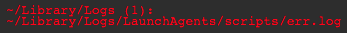

<!--
https://pypi.org/project/readme-generator/
https://pypi.org/project/python-readme-generator/
-->

#### Installation
+   download
+   copy to `~/Library/Application Support/Übersicht/widgets/mac-logs.widget`

#### How it works
finds `~/Library/Logs` non-empty `*err*.log` (err.log, error.log, errors.log, stderr.log, etc)

    <a href="https://pypi.org/project/python-readme-generator/">python-readme-generator</a>

