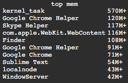

<!--
https://pypi.org/project/readme-generator/
https://pypi.org/project/python-readme-generator/
-->



#### Installation
+   download
+   copy to `~/Library/Application Support/Übersicht/widgets/top-mem.widget`

#### Config
`~/.bashrc`
```bash
export UEBERSICHT_TOP_MEM_COUNT=10
```

<p align="center">
    <a href="https://pypi.org/project/python-readme-generator/">python-readme-generator</a>
</p>